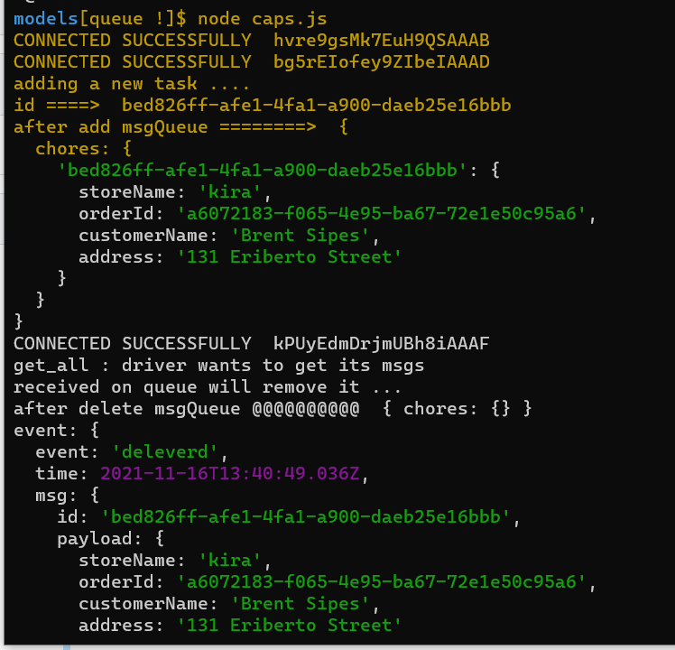
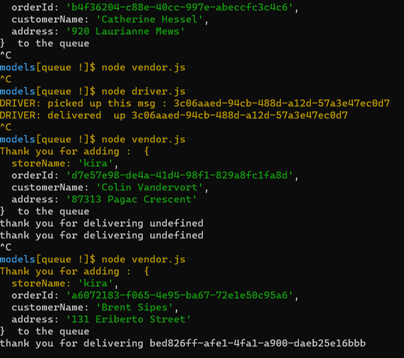
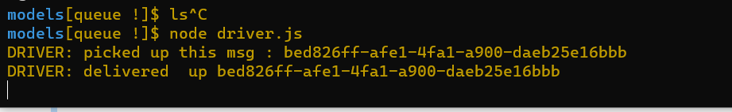
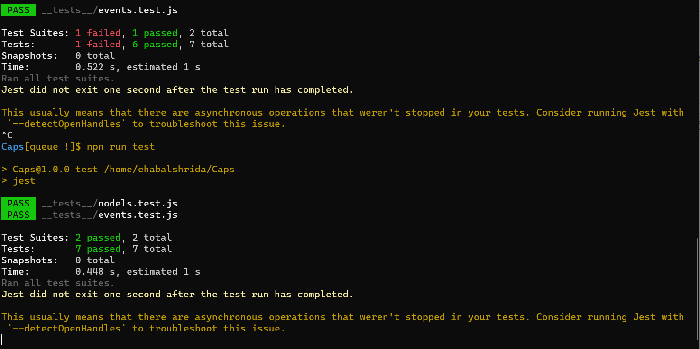

# Caps

## test on github [test](https://github.com/Ehabalshrida/Caps/actions)

## setup 

### .env requirements

 - port number 8000

 ### Running the app
 - node caps.js

 ### test 
 - npm run test

## The output of running the app 

## The output of running the test files

## UML 

[UML](./UML.jpg)
